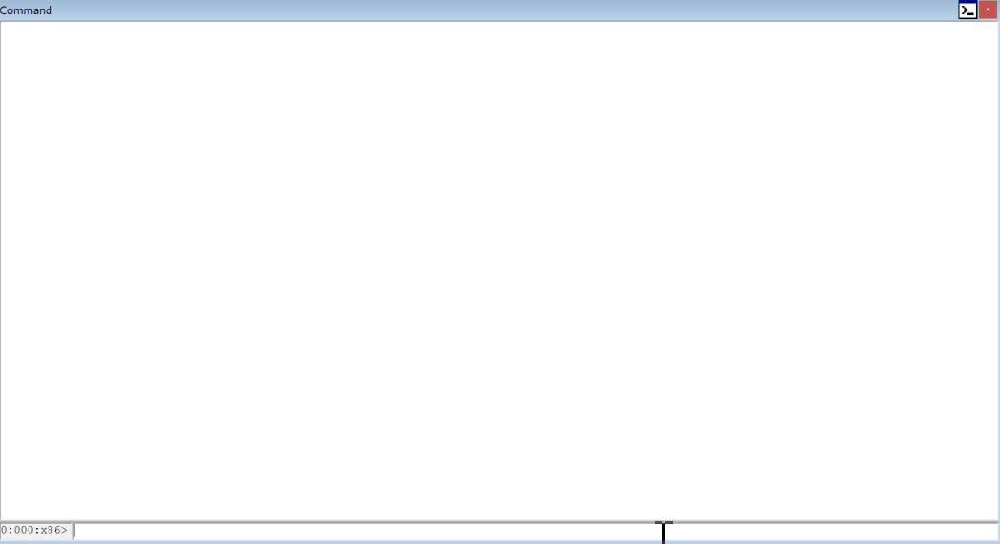

---
Dbghlpr : debugging helper
==============
dbghlpr는 windbg 익스텐션 DLL로, 디버깅 및 분석 과정에 조금 더 편리한 기능을 제공하고자 시작된 프로젝트입니다.

지원하는 기능 및 사용 방법은 doc/*.md 파일을 참조 부탁드립니다.

---

%windbg설치 경로% 아래 dbghlpr 폴더를 생성하여 dbgraph 관련 내용물을 복사하면 graph 기능을 사용할 수 있습니다.
dbghlpr 및 dbgraph이 설치된 내용은 [여기](https://github.com/0a777h/dbghlpr/releases) 에서 확인할 수 있습니다.

---

credits
-------
* disassembly powered by [capstone engine](https://github.com/aquynh/capstone)
* emulator powered by [unicorn engine](https://github.com/unicorn-engine/unicorn)
* string reference powered by [x64dbg](https://github.com/x64dbg/x64dbg)
* graph view powered by [medusa](https://github.com/wisk/medusa), [x64dbg](https://github.com/x64dbg/x64dbg)
