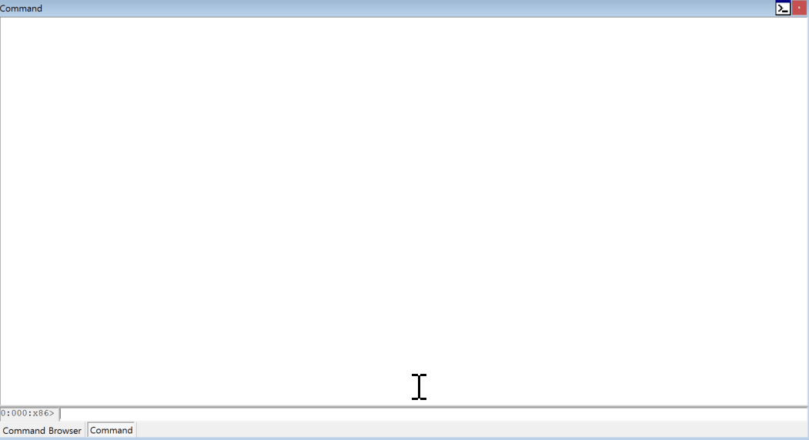

ut
-------
ut 기능은 windbg에 존재하는 uf 기능에 xref 및 심볼 출력, jxx 역추적 등의 기능이 추가 출력됩니다.
또한, command browser(ctrl+n)를 추가하여 정적 분석 흔적을 남길 수 있습니다.
* 최초 값은 옵션 없이 DWORD64 값을 입력받습니다.
* -entry : 해당 플래그가 세팅될 경우, 함수의 진입점부터 출력을 실행합니다.
---

---

